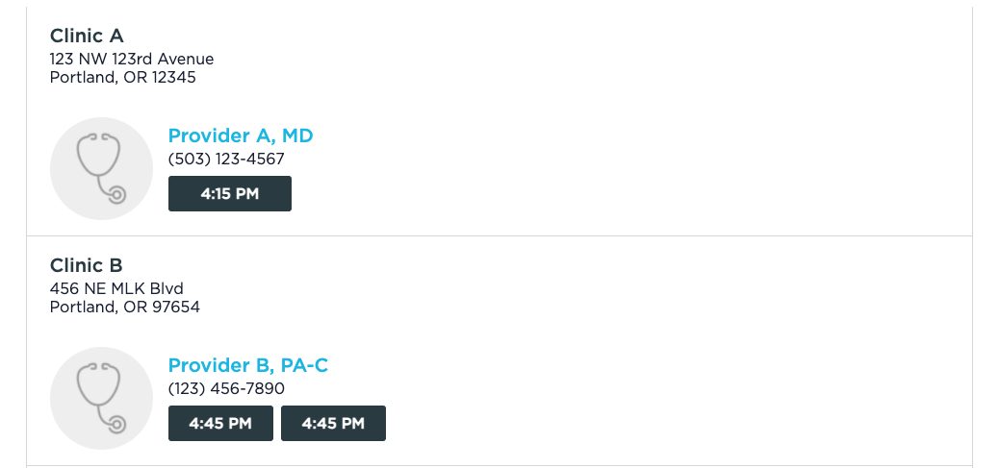

# ZoomCare Candidate Code Challenge - React/Typescript Schedule App


Welcome to the React/Typescript front-end developer challenge! If you are here you most likely have interest in joining the ZoomCare Software Engineering Team and asked to attempt of our software development challenges. If you came here on your own, you are welcome to explore the challenge and use it to sharpen your skills or prepare for future interviews.

The ZoomCare Candidate Code Challenges are intended to take between 1 and 2 hours to complete. This is not intended to be an extensive test of your programing skills or knowledge, but rather as a starting point for further conversations during the application process.

## Requirements
```shell
node -v
# v16.x

npm -v
# v8.x

npm install

npm start
```

## Instructions
1. Create a UI ([screenshot](#example) below) by using the provided mock endpoints that consists of a list of "provider" elements that are populated by what you get from the `/api/appointments` endpoint ([list of endpoints](#endpoints) is below). Each "provider" element should have:

    1. The name and location of the "clinic" as a formatted address. 
        - The clinic data is populated with what you get from the `/api/clinics` endpoint. You will use the `clinicId` property from the `/api/appointments` endpoint to send to the `/api/clinics` in a separate API call.

    2. The name of the provider, with credentials next to it and phone number under it (see example screenshot)

    3. A set of "appointment slots" buttons. These will also come from the `/api/appointments` endpoint, and you will need to group these slots by the provider/clinic they correspond to. 
        - Use the `startTime` property and format it as the screenshot shows for the text of the button.
        
        - These do not need to have any action attached to them, but they should look and act like buttons!
 
2. In order to access these endpoints, you will need to request an access token from the `/api/login` endpoint (see below), and then pass it into the authentication header directly (no authentication scheme, just the token) when you make your requests.

## Endpoints

### `POST /api/login`
This will give you an authentication token you can use in the other endpoints.

### `GET /api/appointments`
This will give you the list of appointment slots in the form of [`AppointmentsDto`](./src/zoomcare-api.d.ts), along with corresponding provider and clinic data.

*You must provide the token that you get from `/api/login` to request this API in the authentication header.*

### `GET /api/clinics/:clinicId:`
This will give you either a list of clinics or a specific clinic in the form of [`ClinicsDto`](./src/zoomcare-api.d.ts), depending on if you provide an ID.

*You must provide the token that you get from `/api/login` to request this API in the authentication header.*
## Example
Use this as a guide for what your final product will look like. Note that the data in the example will not match the data you end up seeing, and that you should feel free to not be exact!


## Steps to Complete
* Create a Fork of the repository into your personal GitHub space.
* Implement a solution.
* Create a Pull Request back to the original project.
